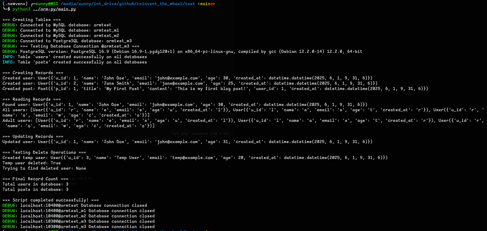

# ORM Layer for SQL

A lightweight ORM-style wrapper for SQL operations.

## Supported Databases

* ✅ MySQL
* ✅ PostgreSQL
* ❌ SQLite *(coming soon)*

## Installation

To install the package from Test PyPI:

```bash
pip install -i https://test.pypi.org/simple/ sa_orm
```

## Usage

Once installed, you can run the [main.py](./main.py) file to see an example in action.

To run this you will also need either of MySQL or Postgres instance.
One way is to run the two sql servers in containers. For that you can use docker compose, mysql server will run on port 10400 and postgressql will run on 10300.
```sh
docker compose up -d  # starts the two containers (in the background) and to stop run `docker compose down`
docker compose up  # foreground container spawn, blocks the current terminal
```

### Running the test script

The main.py proved ids a test script with main db and two shadow db are on mysql server and shadowdb3 on postgressql server.
Below is an example on how it would look like when executed.
It will
- Connect to DB
- Create two tables users and post, post is linked to user with post.user_id = user.u_id
- Read records
    - All rows
    - Rows with a specified condition, age >= 25
- Delete records
    - Create a temp record to delete
    - Delete just the one record
    - Rreturn the status as true if user not found and false if found
    - Show the result of user find query
- Total Records in the tables

The test script was run in an isolated env with the lib download from pypi and db servers from docker compose (to be sure, I stopped mysql and postgres services on my system)

---

## Multi-Write (Replication Support)

The `multi_write` feature acts like a replication system. Any **write** action performed on the **primary database** is also replicated to one or more **shadow databases** (secondary or disaster recovery databases).

You can have any number of shadow databases. Also, a primary MySQL database can replicate to PostgreSQL shadows, and vice versa.

✅️ Successful script run

🚫 Failed run (giving wrong port to one db obj)

---

### Getting Started

1. Define a Table

```python
from sa_orm.base_model import BaseModel

class User(BaseModel):
    _table_name = "users"
    _primary_key = "u_id"
```


2. Create Database Connections

```python
from sa_orm.base.declare import DatabaseType
from sa_orm.base.conn import createConnection

db = createConnection(
    host="localhost",
    port=5432,
    database="ormtest",
    user="postgres",
    password="SudoPass",
    db_type=DatabaseType.POSTGRESQL,
)

db2 = createConnection(
    host="localhost",
    port=3306,
    database="ormtest_m2",
    user="mysql_user",
    password="SudoPass",
    db_type=DatabaseType.MYSQL,
)
```


3. Assign Databases to the Table

```python
User.set_database([db, db2])
```

* The **first database** in the list is treated as the **primary**.
* All subsequent databases are treated as **shadows** (replicas).
* You can assign multiple shadows for redundancy.

> [!CAUTION]
>
> If a shadow database is added after the table creation in primary DB, the tables won't be created in shadow DB.
> Those should be created at the time of adding the DB as shadow DB

4. Create the Table Schema

```python
User.create_table(
    {
        "name": "VARCHAR(100) NOT NULL",
        "email": "VARCHAR(255) NOT NULL",
        "age": "INTEGER",
        "created_at": "TIMESTAMP DEFAULT CURRENT_TIMESTAMP",
    }
)
```

* The `create_table()` method accepts a dictionary where:

  * **Keys** are column names.
  * **Values** are standard SQL column definitions.


---

### Planned Improvements:

- [ ] Restructure The files and populate init files for better library import structure
- [ ] Add table replication feature for shadow DBs
- [ ] Add backfill feature
- [ ] Move to Pydantic model for defining tables (Similar to SQLModel)
- [ ] Adding loacking for r/w protection
- [ ] Implementing async queries
- [ ] Adding option for connection pool and SDK sort of thing for graphQL (distant future)

---
