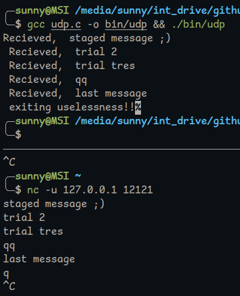

# Implementing a few network protocols

PLAN:
- [x] UDP [barebone implementation in C]
- [x] TCP [barebone implementation in C]
- [ ] HTTPS v1 [GoLang]
- [ ] HTTPS v2 [GoLang]
- [ ] HTTPS v3 [GoLang]

## UDP

The UDP protocaol is very simple with an overhead of just 8 bytes so it is a very simple implementation where everything below layer 4 is managed by a library.
Objectuve: Get a feel for working with sockets - done.

## TCP

TCP has more complexity than UDP, took a little time to understand the headers (20 bytes for this guy) but now did a simple implementation. I skipped a few essential parts like multi-threading the connection accept and session data transfer process as well as undying listener, as I was impatient to move to https. On to HTTPS via TLS ;)

